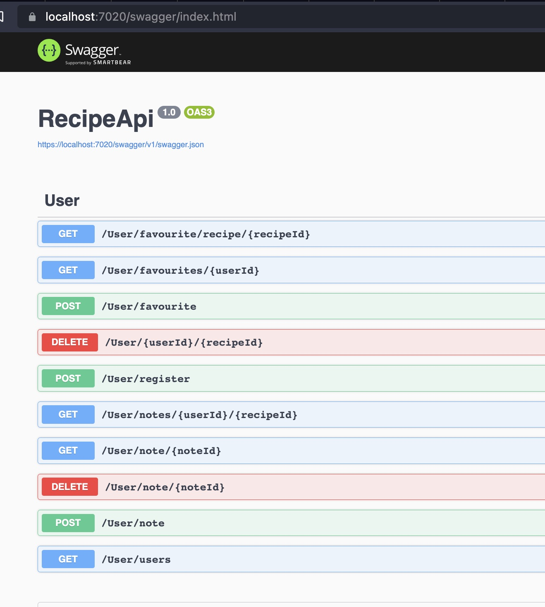
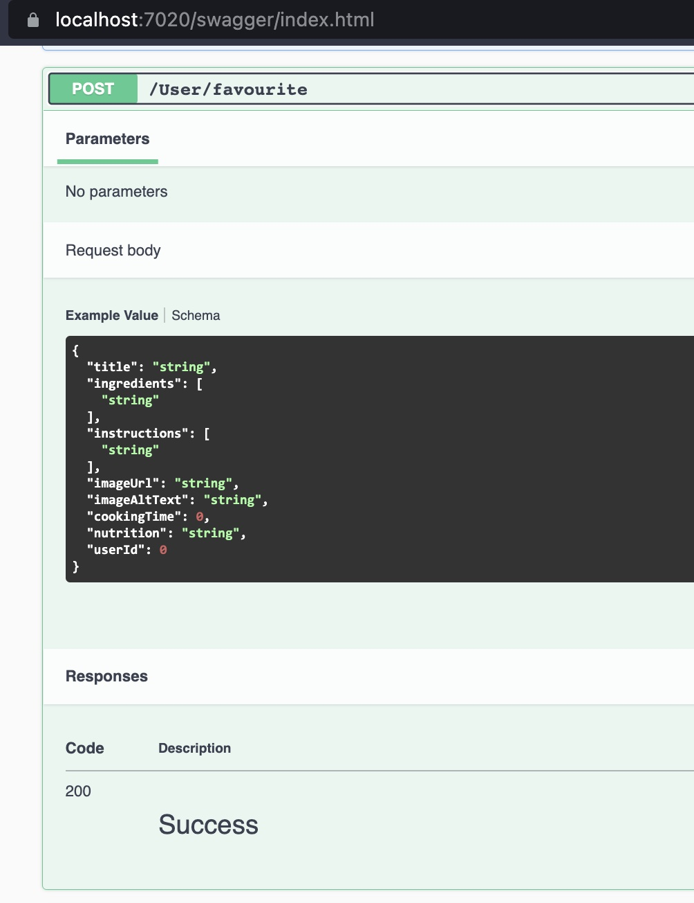
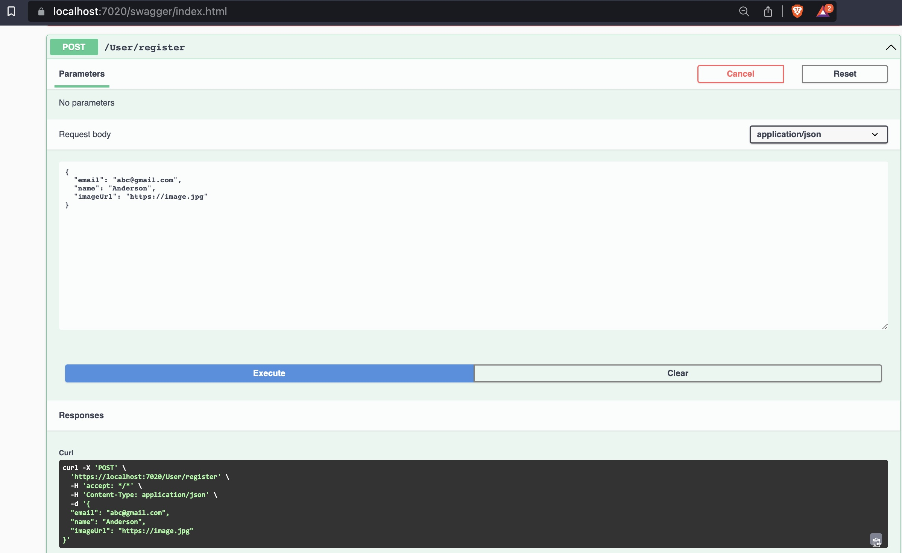

# This is an ASP.NET WebApi project
### The goal of the project is to capture favorite recipes and allow users to create custom notes for recipe improvement or memories capturing.
### It contains api endpoints to be consumed by Tasty-React-Frontend, which uses google login and tasty.com api for recipe exploring.

#### All CRUD operations of User, Note and Recipe tables are implemented.

### This project also
* utilize Entity Framework and maintain the database on Azure SQL server.
* being hosted on Azure platform
* utilize repositories interface to fully tested all endpoints